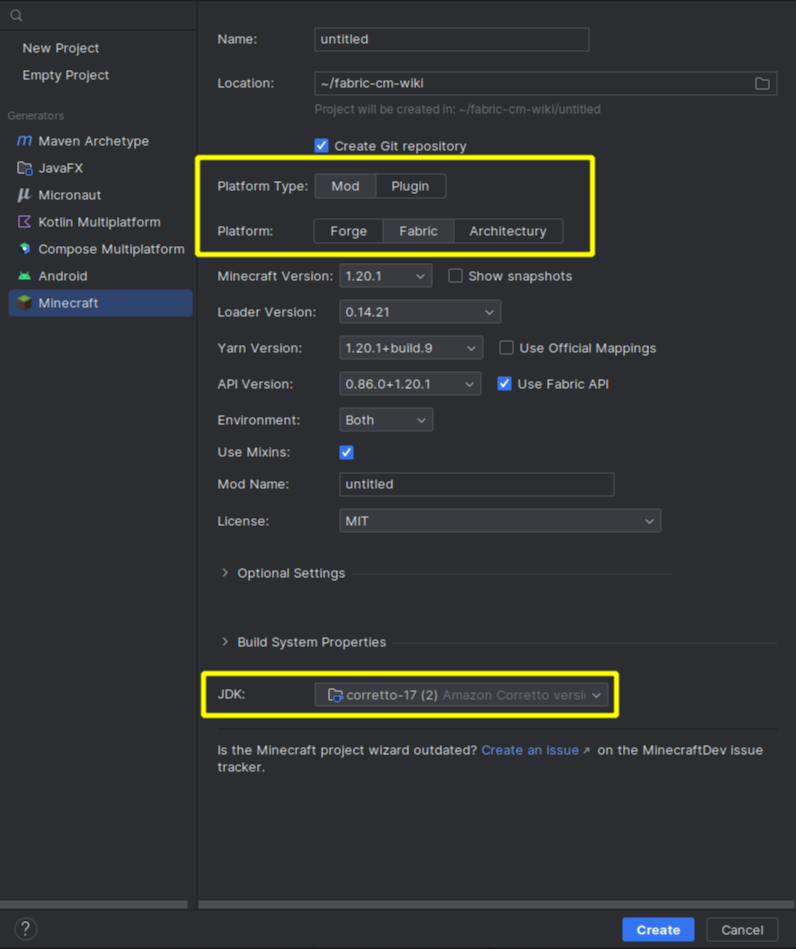

# Creating A Project

There are many ways to create a mod project, however we recommend you either use the Fabric CLI or the built-in MCDev Plugin project wizard.

## Fabric CLI

### Installing Deno

The Fabric CLI uses Deno - you will need to install Deno to use Fabric CLI.

::: code-group

```sh [Windows (Powershell)]
irm https://deno.land/install.ps1 | iex
```

```sh [MacOS/Linux (Shell/Bash)]
curl -fsSL https://deno.land/x/install/install.sh | sh
```

:::

### Installing Fabric CLI

Once you have installed Deno, you can install the Fabric CLI through the `deno install` command:

```sh
deno install -A -n fabric https://fabricmc.net/cli
```

### Using Fabric CLI

When you're ready, run the `fabric init` command to create your mod project.

It will ask you various questions, such as your mod name, mod ID and package name.

::: warning
When asked about "Advanced Options" make sure to disable "Split client and common sources" as this will overcomplicate tutorials on this wiki. You can leave it enabled **if you know what you're doing.**
:::

## MCDev Project Wizard

To create a project using the MCDev project wizard, press "New Project" on the "Welcome to IntelliJ IDEA" window.

You'll want to select the "Minecraft" generator in the left sidebar.

Make sure that you have selected "Mod" for the Platform Type toggle, "Fabric" for the loader toggle, and that a Java 17 JDK is selected at the bottom:



Click "Create" to start the project creation process - this may take a few minutes, don't close the IDE or cancel during this process or you will have to delete the folder your project was created in and restart!