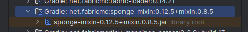
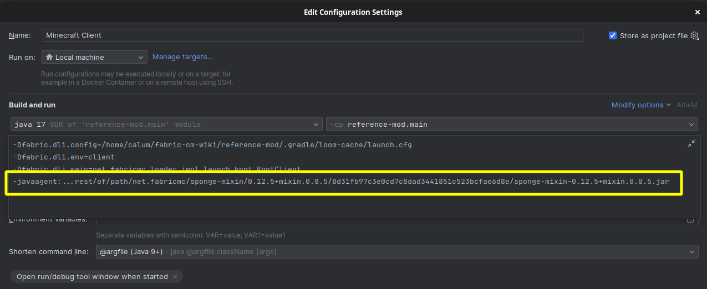

# Launching Minecraft

To launch Minecraft with your mod installed, you can choose the "Minecraft Client" task in your Run Configurations list - it's recommended you launch in "Debug" mode as this will allow you to [hotswap](/getting-started/basic-problem-solving#reloading-an-active-instance) methods and create [breakpoints](/getting-started/basic-problem-solving#breakpoint) where possible.


If the run configurations don't exist, reload the project. If they still dont exist, you can alternatively use the `gradlew runClient` command instead. This is not recommended though as hotswapping and various debug tools are not available.

You should see the game launch in development mode - you are unauthenticated and cannot join any online servers in this mode:


## Authentication

If you need to log into an actual account instead of being stuck in offline mode, you can utilize the ["DevLogin" library by PlanetTeamSpeakk](https://github.com/PlanetTeamSpeakk/DevLogin)

Simply add the following to the `build.gradle` file found in the root of your mod project:

```groovy
repositories {
  mavenCentral()

  // ...
}

dependencies {
  modImplementation "com.ptsmods:devlogin:3.3"

  // ...
}
```

Next, you'll need to add the `--msa-nostore` argument to your "Minecraft Client" run configuration:


Now, when launching the game, you will be prompted to authenticate with Microsoft.

If you wish to store the authentication token, simply replace `--msa-nostore` with the `--msa` argument. This is not recommended though.

## Hot Swapping

Hot Swapping is only available when the run configurations are ran in "Debug" mode - even then, you're still quite limited:

- You can't add or remove methods
- You can't change method parameters
- You can't add or remove fields

## Hot Swapping Mixins

If you wish to hot-swap mixins, you need to mark the mixin jar library as a java agent.

### 1. Locate the Mixin library jar.

In IntelliJ IDEA, you can find the mixin library jar in the "External Libraries" section of the "Project" section:



You will need to copy the jar's "Absolute Path" 

### 2. Add the `-javaagent` VM argument.

In your "Minecraft Client" and or "Minecraft Server" run configuration, add the following to the VM Arguments option:

```
-javaagent:"path to mixin library jar here"
```



Now, you should be able to modify the contents of your mixin methods.